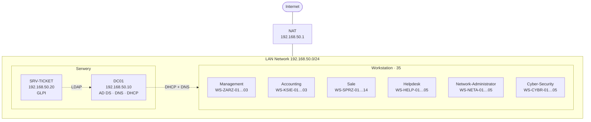

# 🏢  NismoNET IT Support Lab - Corporate Environment Simulation

# 📌 About the Project

The project is a fully functional, virtual IT environment for a small business (NismoNET), created to demonstrate and develop skills in Windows Server administration, PowerShell automation, and technical support (Helpdesk).

The environment simulates the work of 35 employees divided into 6 operational departments. The project includes centralized identity management, group policies, a file server with appropriate restrictions, a ticketing system, and a set of SOPs.

# 🏗️ Architecture and Networking

## 📅 Implementation Roadmap
Below is a chronological record of the environment's setup. Each step links to a separate document containing screenshots, the scripts used, and a description of the configuration.

* **[Phase 1: Domain Controller Installation and Configuration](./docs/phase1-ad.md)**
  * Installation and configuration of Windows Server 2022 (DC01).
  * Deployment of AD DS, DNS, and DHCP roles.
  * Creation of a logical OU (Organizational Units) structure that reflects the company’s departments.
 
